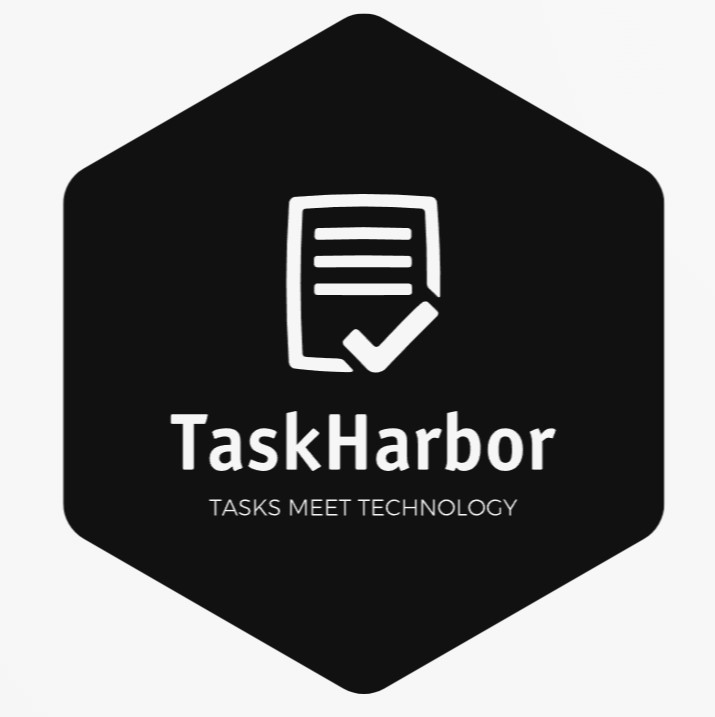

# Blockchain Group Project README

<kbd></kbd>

## Table of Contents

1. [Project Topic](#project-topic)
2. [Tools/Software](#toolssoftware)
3. [Project Breakdown/Contribution](#project-breakdown)
4. [Key Features](#key-features)
5. [References](#references)

## 1. Project Topic: TaskHarbor - Task Management Application

**Problem Statement** :- Our project  **Taskharbor** is being developed to address the inefficiencies and lack of transparency in traditional task management systems. In many existing task management platforms, users face issues related to trust, accountability, and data security. 

**TaskHarbor** is a robust task management application that is designed to cater to your organizational needs. This project offers a comprehensive set of features to enhance task management and streamline your workflow.

TaskHarbor is versatile tools that can be used for a wide range of purposes and can help individuals and organizations stay organized and productive. Here are some different uses of apps:- **Daily Journel , Personal Task Management , Project Management , Daily Planning , Goal Tracking , Shopping Lists , Note-Taking , Collaborative Work , Travel Planning , Event Planning , Budgeting , Health and Wellness** etc.

##  Blockchain Integration

TaskHarbor is developed within the scope of blockchain technology, leveraging its unique features to enhance security, transparency, and user trust:

- **Blockchain Data Security**: All task-related data is stored securely on the blockchain, ensuring data integrity and protection from unauthorized access or tampering.
- **Decentralized Task Tracking**: The decentralized nature of blockchain technology ensures that task data is not controlled by a central authority, enhancing user control and privacy.
- **Immutable Task Records**: Once a task is created or updated, the data is recorded immutably on the blockchain, providing a transparent and auditable history of task-related activities.
- **Smart Contract Integration**: Smart contracts are utilized to automate task-related actions, such as task completion verification, ensuring efficient and trustless task management.

## 2. Tools/Software

### For Ethereum Blockchain Technology:

1. **Smart Contract**: Self-executing contracts written in code, residing on the Ethereum blockchain, enabling trustless and automated task management in TaskHarbor.
2. **Solidity**: A specialized programming language for creating smart contracts on Ethereum, used to define the rules and behavior of TaskHarbor's contract interactions.
3. **Remix IDE**: A web-based development environment facilitating the creation, testing, and deployment of smart contracts for TaskHarbor on the Ethereum blockchain.
4. **MetaMask**: A browser extension and wallet serving as the gateway for TaskHarbor users to securely manage their Ethereum-based transactions and interactions.
5. **Ganache**: A local blockchain emulator and development tool, providing a controlled environment for testing TaskHarbor's smart contracts and ensuring their reliability.

### For Client Side:

6. **React**: A powerful JavaScript library for creating dynamic and interactive user interfaces, enabling seamless task management in TaskHarbor through responsive and engaging web components.
7. **HTML (Hypertext Markup Language)**: The foundational markup language for structuring web pages, defining the structure and content of TaskHarbor's user interface.
8. **Bootstrap**: An open-source front-end framework simplifying the design of TaskHarbor's responsive and visually appealing web pages, utilizing pre-designed components for efficiency.
9. **JavaScript**: A versatile programming language enabling the creation of dynamic features within TaskHarbor, enhancing user interactions and content manipulation.

### For Server Side:

10. **Node.js**: A runtime environment for executing server-side JavaScript code, powering TaskHarbor's backend with scalability and high performance.
11. **Express.js**: A minimal and flexible Node.js framework streamlining the handling of HTTP requests, routing, and middleware for TaskHarbor's web application.
12. **Postman**: A collaboration platform for testing TaskHarbor's API functionality, ensuring smooth and reliable communication between client and server components.

## 3. Project Breakdown

Our project plan provides a precise breakdown of tasks, division of work, and team members' responsibilities, ensuring a systematic approach to development. Work is evenly distributed among team members.

### Team Members and Responsibilities

1. **Arpit Jain and Vishal Jain**:
   - Front-End Development: Leveraging React, HTML, Bootstrap, and JavaScript, both will focus on creating a user-friendly and responsive front-end interface for TaskHarbor.
   - Integration: They will work closely with the backend and blockchain teams to integrate the front end seamlessly.
   - Bug Fixes and Workflow: They will test the project and address any bugs, optimize workflow processes, and refine the problem statement.
   - Case Studies: They will explore various scenarios for improvement and suggest enhancements for TaskHarbor's functionality.

2. **Manan Aggarwal**:
   - Blockchain Technology: Manan will be dedicated to working with Ethereum blockchain technologies, including Solidity, Remix IDE, and MetaMask.
   - Smart Contracts: He will develop and test smart contracts to ensure the secure and efficient execution of TaskHarbor's blockchain interactions.

3. **Manish Kumar Sharma**:
   - Back-End Development: Manish will lead the back-end development efforts, utilizing Node.js and Express.js to create a robust and efficient server for TaskHarbor.
   - API Integration: He will ensure seamless communication between the front-end and back-end components.
     

## 4. Key Features

1. **Create a Task**: The core functionality of TaskHarbor revolves around task creation. Quickly add new tasks, assign names, set deadlines, and include relevant notes to maintain meticulous organization.
2. **Update a Task**: Easily modify task details, including descriptions, due dates, and priority levels. Adapt to changing circumstances with flexibility and precision.
3. **View the Task**: Access a clear and concise overview of all your tasks, including task names, due dates, and completion status. Stay informed and make informed decisions about your priorities.
4. **Get Status of the Task**: The "Task Status" feature provides real-time insights into task progress, helping you identify pending, in-progress, and completed tasks. Maintain a clear understanding of your project's status.
5. **Delete a Task**: Streamline your task list by effortlessly removing tasks that are no longer relevant. Keep your workspace organized and clutter-free by eliminating completed tasks.
6. **Wallet Integration**: TaskHarbor offers seamless integration with MetaMask, allowing you to monitor recent Ethereum transactions and check your Ethereum balance without leaving the application.

## 5. References

1. https://www.dappuniversity.com/articles/how-to-build-a-blockchain-app
2. https://www.flexmind.co/to-do-list-using-ethereum-2/
3. https://medium.com/unitechie/build-todo-application-in-react-and-solidity-538ef2f1f54f
4. https://ethereum.org/en/developers/docs/smart-contracts/
5. https://101blockchains.com/how-to-build-a-blockchain-app/

